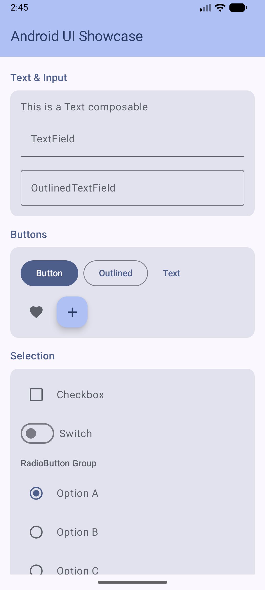

# Android Playground

An Android playground app for exploring and showcasing modern Android UI components and architecture patterns.

## Current Status

The app features an interactive UI showcase screen demonstrating Material 3 components, built with an MVVM architecture using ViewModel and StateFlow.

## Features

- **UI Showcase** - Scrollable screen demonstrating Material 3 components grouped by category:
  - Text & Input (TextField, OutlinedTextField)
  - Buttons (Button, OutlinedButton, TextButton, IconButton, FAB)
  - Selection (Checkbox, Switch, RadioButton group)
  - Indicators & Sliders (Slider, LinearProgressIndicator, CircularProgressIndicator)
  - Cards & Chips (Card, AssistChip, FilterChip)

## Tech Stack

| Layer | Technology |
|---|---|
| Language | Kotlin 2.0.21 |
| UI | Jetpack Compose with Material 3 |
| Architecture | MVVM (ViewModel + StateFlow) |
| State Collection | `collectAsStateWithLifecycle` |
| Build System | Gradle (Kotlin DSL) + Version Catalog |
| Min SDK | 24 (Android 7.0) |
| Target/Compile SDK | 35 |
| Testing | JUnit 4, Kotlinx Coroutines Test |

## Screenshot

<p align="center">
  
</p>

## Build

```bash
./gradlew assembleDebug       # Build debug APK
./gradlew installDebug        # Install on connected device/emulator
./gradlew test                # Run unit tests
```

Requires JDK 17+ and Android SDK.
